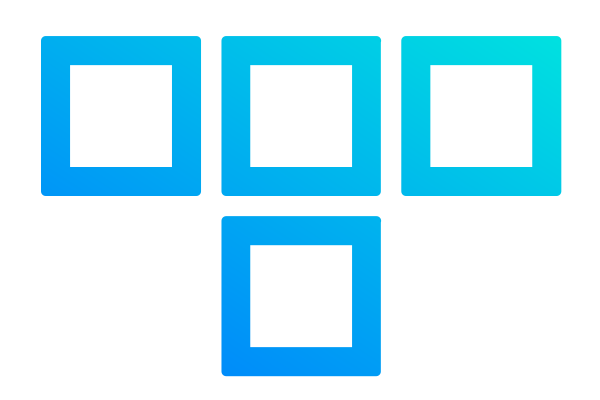

# Technis

 

    

## 📖 Overview

This repository serves as the **single source of truth** for my homelab infrastructure to manage everything from baremetal provisioning to application deployment.

Death, taxes, and making improvements.
