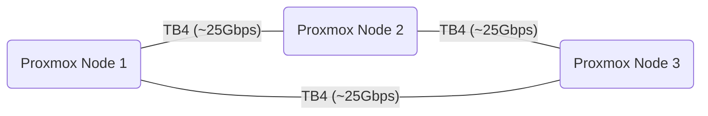

# Thunderbolt Network

Three nodes connected using Thunderbolt 4 for a ring topology network capable of up to ~25Gbits/s.

## Network Diagram



## Before (2.5GbE link)

```sh
root@ms-02:~# iperf3 -c 192.168.144.1
Connecting to host 192.168.144.1, port 5201
[  5] local 192.168.144.2 port 49206 connected to 192.168.144.1 port 5201
[ ID] Interval           Transfer     Bitrate         Retr  Cwnd
[  5]   0.00-1.00   sec   284 MBytes  2.38 Gbits/sec    0    662 KBytes
[  5]   1.00-2.00   sec   280 MBytes  2.35 Gbits/sec    0    662 KBytes
[  5]   2.00-3.00   sec   281 MBytes  2.36 Gbits/sec    0    694 KBytes
[  5]   3.00-4.00   sec   280 MBytes  2.35 Gbits/sec    0    694 KBytes
[  5]   4.00-5.00   sec   281 MBytes  2.36 Gbits/sec    0    730 KBytes
[  5]   5.00-6.00   sec   280 MBytes  2.35 Gbits/sec    0    730 KBytes
[  5]   6.00-7.00   sec   281 MBytes  2.36 Gbits/sec    0    730 KBytes
[  5]   7.00-8.00   sec   280 MBytes  2.35 Gbits/sec    0    730 KBytes
[  5]   8.00-9.00   sec   281 MBytes  2.36 Gbits/sec    0    730 KBytes
[  5]   9.00-10.00  sec   280 MBytes  2.35 Gbits/sec    0    730 KBytes
- - - - - - - - - - - - - - - - - - - - - - - - -
[ ID] Interval           Transfer     Bitrate         Retr
[  5]   0.00-10.00  sec  2.74 GBytes  2.36 Gbits/sec    0             sender
[  5]   0.00-10.00  sec  2.74 GBytes  2.35 Gbits/sec                  receiver

iperf Done.
```

## After (40Gbps link)

```sh
root@ms-02:~# iperf3 -c 192.168.144.1
Connecting to host 192.168.144.1, port 5201
[  5] local 192.168.144.2 port 59072 connected to 192.168.144.1 port 5201
[ ID] Interval           Transfer     Bitrate         Retr  Cwnd
[  5]   0.00-1.00   sec  2.10 GBytes  18.0 Gbits/sec  622   1.69 MBytes
[  5]   1.00-2.00   sec  1.84 GBytes  15.8 Gbits/sec  423   2.19 MBytes
[  5]   2.00-3.00   sec  1.95 GBytes  16.7 Gbits/sec  480   1.62 MBytes
[  5]   3.00-4.00   sec  2.66 GBytes  22.8 Gbits/sec  585   1.69 MBytes
[  5]   4.00-5.00   sec  1.99 GBytes  17.1 Gbits/sec  573   1.56 MBytes
[  5]   5.00-6.00   sec  1.69 GBytes  14.5 Gbits/sec  483   1.62 MBytes
[  5]   6.00-7.00   sec  1.84 GBytes  15.8 Gbits/sec  619   1.75 MBytes
[  5]   7.00-8.00   sec  1.88 GBytes  16.1 Gbits/sec  462   1.81 MBytes
[  5]   8.00-9.00   sec  2.63 GBytes  22.6 Gbits/sec  891   1.50 MBytes
[  5]   9.00-10.00  sec  2.09 GBytes  18.0 Gbits/sec  727   1.69 MBytes
- - - - - - - - - - - - - - - - - - - - - - - - -
[ ID] Interval           Transfer     Bitrate         Retr
[  5]   0.00-10.00  sec  20.7 GBytes  17.7 Gbits/sec  5865             sender
[  5]   0.00-10.00  sec  20.7 GBytes  17.7 Gbits/sec                  receiver

iperf Done.
```

Looks like we might be limited by the NVMes! 😅
